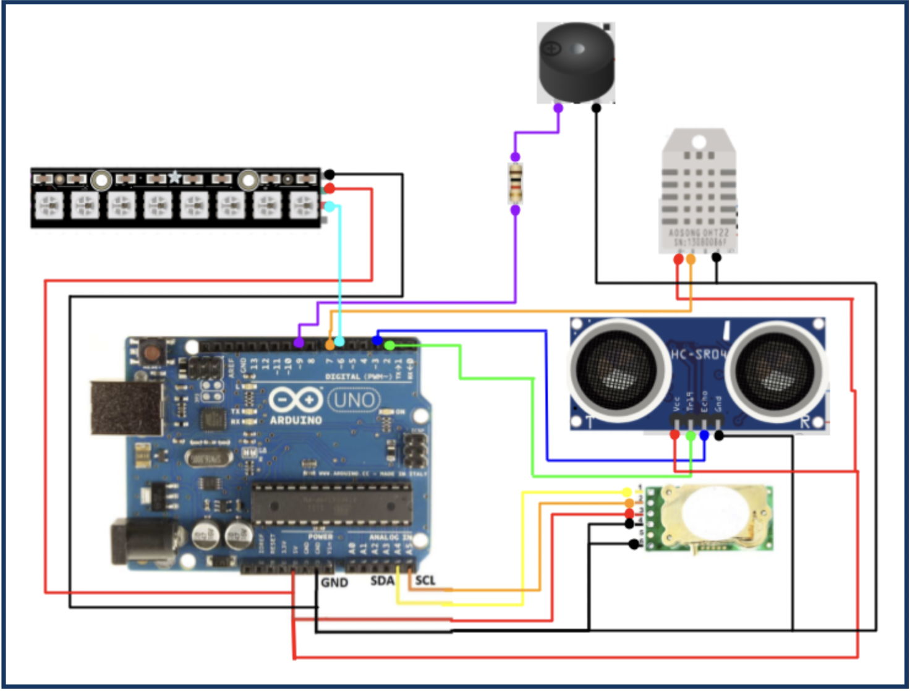

# Sourdough Bread Starter Monitor

The device developed for this project is a sourdough bread starter monitor. The device collects data on vital environmental conditions for bread starter health (temperature, humidity and CO₂ levels) and presents this information clearly to the user.

A full detailed report on this project can be found in the report directory.

## Hardware

## Circuit Diagram

